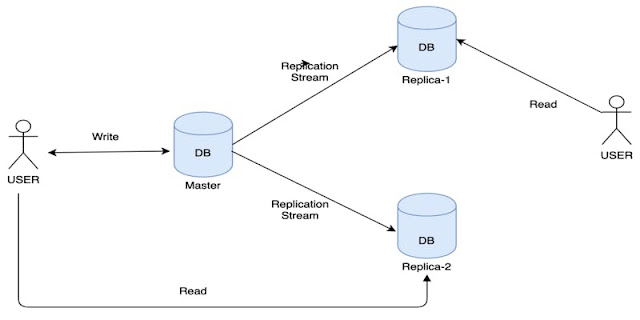
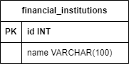

# Database

## Table of Contents
<!--ts-->
   * [Technology](#technology)
   * [Design](#design)
      * [Architecture](#architecture)
      * [Entity Relationship Model](#entity-relationship-model)
   * [Development](#development)
      * [Migrations](#migrations)
<!--te-->

## Technology
* [MySQL](https://www.mysql.com/)

## Design

### Architecture
This project will follow a [master-slave architecture](https://medium.com/@ayogun/master-slave-database-architecture-in-a-nutshell-e20a73e979d1) for its database, where there will be one write instance followed by n read instances.



### Entity Relationship Model



## Development

### Migrations

A migration typically consists of two distinct files, one for moving the database to a new state (referred to as "up") and another for reverting the changes made to the previous state (referred to as "down").

The format of those files for SQL are:

```
{sequence_number}_{title}.down.sql
{sequence_number}_{title}.up.sql
```

⚠️<i> Obs: The migrations are executed by the application by [golang-migrate](https://github.com/golang-migrate/migrate) tool</i>