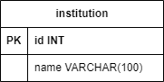

# Databases

## Table of Contents
<!--ts-->
   * [Institution (MySQL)](#institution-mysql)
      * [ER Diagram](#er-diagram)
<!--te-->   

## Institution ([MySQL](https://www.mysql.com/))
Database used to store data about financial institutions. 

### ER Diagram

